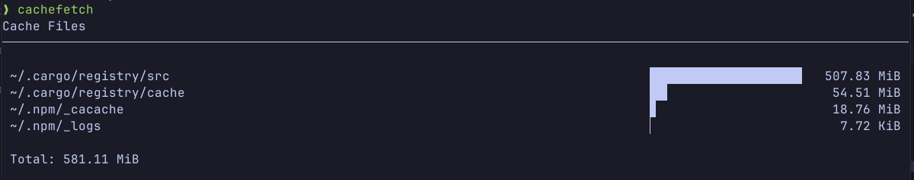

# cachefetch

cachefetch is very fast, configurable CLI fetch tool thats shows your cache file sizes in your disk.

[](https://crates.io/crates/cachefetch)
[](https://github.com/ErenayDev/cachefetch/actions/workflows/ci.yml)
[](https://wakatime.com/@Erenay/projects/uqbuzqarvr)

## Preview



## Installation

<a href="https://repology.org/project/rust%3Acachefetch/versions">
    
</a>

### Arch Linux / AUR

```sh
$ sudo pacman -S cachefetch-bin
```

Or you can directly install prebuilt binary with [binstall](https://github.com/cargo-bins/cargo-binstall).

```bash
$ cargo binstall cachefetch
```

### From Source

Requires **Rust** and **Cargo**:

```bash
$ git clone https://github.com/ErenayDev/cachefetch.git
$ cd cachefetch
$ cargo install --path .
```

Or with `yay`

```bash
$ yay -S cachefetch
```

After installation, you can run `cachefetch` in your terminal.

## Configuration

Just a placeholder now. Coming soon..

#### Sponsors

<p align="center">
  <a href="https://github.com/sponsors/ErenayDev">
    
  </a>
</p>

## Star History

[](https://app.repohistory.com/star-history)

## Contributing

Contributions are welcome! You can open a Pull Request.

---

This project was created and is being developed by [ErenayDev](https://erenaydev.com.tr)
